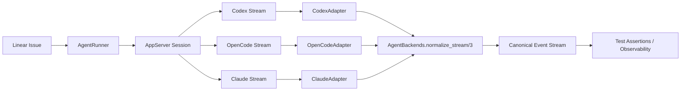

# Multi-Backend Architecture

This document explains how Symphony validates and documents a multi-backend model for Codex, OpenCode, and Claude app-server protocols.

## Overview

Symphony keeps runtime execution in a single app-server client (`SymphonyElixir.Codex.AppServer`) and validates backend protocol compatibility through adapter normalization.



## `AgentBackend` Behaviour Contract

`SymphonyElixir.AgentBackend` defines the adapter contract:

```elixir
@callback normalize_event(map()) ::
  {:ok, canonical_event()} | :ignore | {:error, term()}
```

Canonical event payload:

```elixir
%{
  event: atom(),
  message: String.t() | nil,
  tool: String.t() | nil,
  status: atom() | nil
}
```

`SymphonyElixir.AgentBackends.normalize_stream/3` enriches each canonical event with:

- `backend` (`:codex | :opencode | :claude`)
- `issue_id` (logical issue identity for isolation checks)
- `raw_event` (original backend payload for debugging)

## Protocol Mapping Table

| Canonical semantic | Codex payload | OpenCode payload | Claude payload |
| --- | --- | --- | --- |
| Session started | `{"method":"thread/started"}` | `{"event":"session.started"}` | `{"type":"session_started"}` |
| Turn started | `{"method":"turn/started"}` | `{"event":"turn.started"}` | `{"type":"turn_started"}` |
| Message delta | `{"method":"item/agentMessage/delta", ...}` | `{"event":"message.delta", ...}` | `{"type":"content_delta", ...}` |
| Tool call | `{"method":"item/tool/call", ...}` | `{"event":"tool.call", ...}` | `{"type":"tool_use", ...}` |
| Turn completed | `{"method":"turn/completed"}` | `{"event":"turn.completed"}` | `{"type":"turn_completed"}` |
| Turn failed | `{"method":"turn/failed", ...}` | `{"event":"turn.failed", ...}` | `{"type":"turn_failed", ...}` |

## Canonical Event Format

Normalized streams are semantically compared by projecting each event to:

```elixir
%{event: event.event, message: event.message, tool: event.tool}
```

That projection is used in `BackendProtocolConsistencyTest` to ensure protocol differences remain transport-level only, not behavior-level.

## Reliability Test Coverage

Current integration coverage for the architecture:

- Protocol consistency tests across all adapters.
- Live E2E matrix (`:codex`, `:opencode`, `:claude`) against real Linear workflow.
- Fallback tests for startup failure and turn timeout.
- Mixed-backend concurrency tests for issue isolation.
